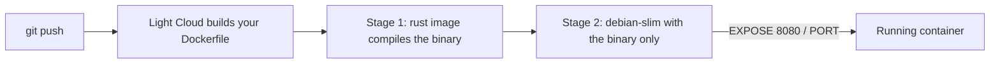

# tutorial-dockerfile-app

A small Rust (axum) word counter with its own Dockerfile, used in the Light Cloud tutorial
[Bring your own Dockerfile: deploy anything that runs in a container](https://blog.light-cloud.com/tutorials/deploy-any-app-with-a-dockerfile).



## Run it

```sh
cargo run
curl -X POST localhost:8080/count -H "content-type: application/json" -d '{"text":"hello world"}'
```
